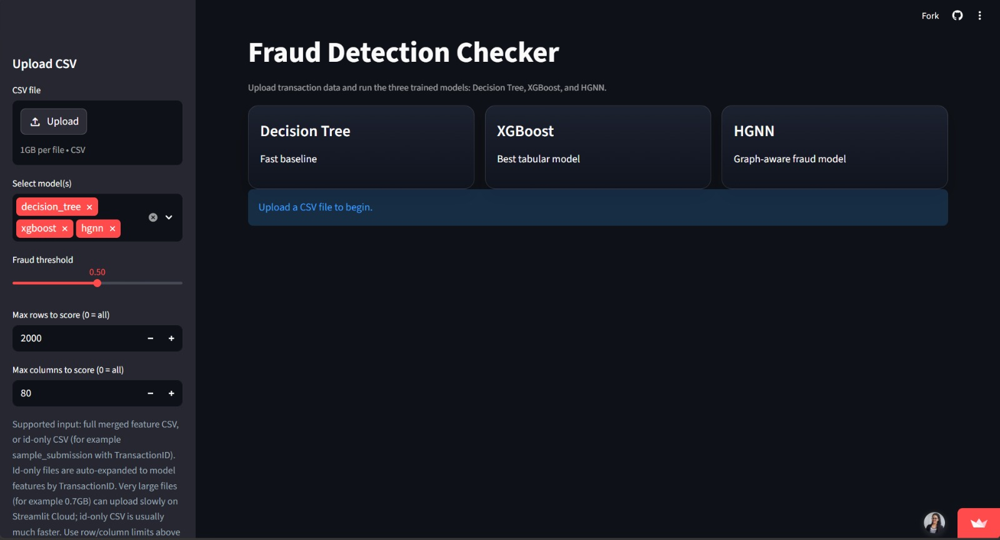

# Credit Card Fraud Detection System

A reproducible pipeline for credit card fraud detection using feature engineering, classical ML, and graph neural networks. This repository contains data preprocessing, training notebooks, model artifacts, and utilities to run inference.

## Key features
- Data loading and preprocessing scripts in `src/`
- Example training notebooks (Decision Tree, XGBoost, HGNN) in `notebook/`
- Pretrained model artifacts in `models/`
- Prediction and evaluation utilities in `src/`

## Dataset
Place the CSV files in the `data/` folder. This project includes train and test CSVs used in the notebooks:

- `data/train_transaction.csv`, `data/train_identity.csv`
- `data/test_transaction.csv`, `data/test_identity.csv`

## Repository structure

- [app.py](app.py) — optional entry-point for inference or quick experiments
- [requirements.txt](requirements.txt) — Python dependencies
- [notebook/02_train_decision_tree.ipynb](notebook/02_train_decision_tree.ipynb)
- [notebook/03_train_xgboost.ipynb](notebook/03_train_xgboost.ipynb)
- [notebook/04_train_hgnn.ipynb](notebook/04_train_hgnn.ipynb)
- [src/](src/) — core Python modules (data loading, preprocessing, models, training, utils)
- [models/](models/) — saved model artifacts (e.g. `hgnn_att_td.pt`, `xgboost_booster.json`)
- [outputs/](outputs/) — generated outputs and temporary predictions

## Quickstart

1. Create and activate a virtual environment:

```bash
python -m venv .venv
# Windows
.venv\Scripts\activate
# macOS / Linux
source .venv/bin/activate
```

2. Install dependencies:

```bash
pip install -r requirements.txt
```

Note: If you plan to run the HGNN notebooks and use TensorFlow on Windows, use Python 3.12 (see workspace notes) — TensorFlow may not be available on newer Windows Python versions.

3. Run a notebook or the training scripts. Example: open `notebook/02_train_decision_tree.ipynb` and run the cells.

## Training & Evaluation

- Notebooks under `notebook/` demonstrate preprocessing, feature engineering, training, and evaluation for different models.
- Use `src/training.py` and `src/evaluation.py` for scriptable training and metrics computation.

## Models

- Trained model artifacts are stored in the `models/` folder. You can load the XGBoost model from `models/xgboost_booster.json` or PyTorch HGNN models from `.pt` files.

## Outputs

- Prediction examples and evaluation outputs are saved to `outputs/` (e.g. `tmp_predictions.csv`).

## Contributing

Feel free to open issues or pull requests. Suggested next steps:

- Add a `LICENSE` if you intend to publish the project.
- Add automated tests for data-loading and preprocessing functions in `src/`.

## Contact
For questions, run the notebooks or open an issue in the repository.
# 🚀 Credit Card Fraud Detection System


A production-ready **end-to-end machine learning and deep learning system** for detecting fraudulent credit card transactions in real time. This project integrates advanced imbalance handling, multiple model architectures (ML + DL), modular pipelines, and a deployed Streamlit web application.

---

## 📌 Problem Statement

Credit card fraud detection is challenging due to:

- Extremely **imbalanced datasets** (fraud < 1%)
- Continuously evolving fraud patterns
- Need for **real-time prediction systems**

This project aims to build a scalable and accurate system that detects fraudulent transactions while minimizing false positives.

---

## 🎯 Objectives

- Develop robust ML and DL models for fraud detection  
- Handle severe class imbalance using advanced techniques  
- Compare multiple models for performance optimization  
- Build a real-time prediction system  
- Deploy an interactive web interface  

---

## 🛠️ Tech Stack

- **Language:** Python  
- **Libraries:** Pandas, NumPy, Scikit-learn  
- **Models:** Decision Tree, XGBoost, HGNN (Deep Learning)  
- **Imbalance Handling:** SMOTE, ADASYN  
- **Visualization:** Matplotlib, Seaborn  
- **Deployment:** Streamlit  
- **Environment:** Jupyter Notebook  

---

## 📊 Dataset

- **Source:** Kaggle Credit Card Fraud Dataset  
- **Description:**
  - European cardholder transactions  
  - PCA-transformed features (`V1–V28`)  
  - Includes `Time`, `Amount`, and `Class` (0 = Legit, 1 = Fraud)  

- **Challenge:** Highly imbalanced dataset  

---

## 📁 Project Structure

```
fraud-detection/
│
├── README.md
├── .gitignore
├── requirements.txt
│
├── app.py                         # Streamlit web interface
├── predict_models_options.py      # CLI batch prediction script
│
├── src/
│   ├── config.py                  # Paths, hyperparameters, constants
│   ├── utils.py                   # Logging, helpers
│   ├── data_loader.py             # Load dataset
│   ├── feature_engineering.py     # PCA, feature selection
│   ├── preprocessing.py           # Cleaning & splitting
│   ├── models.py                  # ML & DL models
│   ├── training.py                # Training pipeline
│   ├── evaluation.py              # Metrics
│   ├── hgnn_utils.py              # Graph utilities
│
├── notebooks/
│   ├── preprocessing.ipynb
│   ├── 02_train_decision_tree.ipynb
│   ├── 03_train_xgboost.ipynb
│   ├── 04_train_hgnn.ipynb
│   ├── 05_evaluation.ipynb
│
├── data/
├── models/
├── outputs/

```

---

## ⚙️ Model & Methodology

### 🔹 Preprocessing

- Data cleaning and validation  
- Feature scaling (`Amount`, `Time`)  
- Dimensionality reduction (PCA)  
- Handling imbalance using:
  - **SMOTE**
  - **ADASYN**

---

## 🧠 Model Comparison

| Model            | Type                                | Imbalance Strategy                          |
|------------------|-------------------------------------|---------------------------------------------|
| Decision Tree    | Interpretable baseline              | `class_weight='balanced'` + SMOTE           |
| XGBoost          | Gradient boosting                   | `scale_pos_weight` + SMOTE                  |
| HGNN-ATT-TD ⭐   | Heterogeneous Graph Neural Network  | Focal Loss + temporal decay                 |

---

### 🔹 Training

- Modular pipeline-based training  
- Balanced dataset using resampling techniques  
- Hyperparameter tuning for performance optimization  

---

### 🔹 Evaluation

- Accuracy  
- Precision  
- Recall  
- F1-Score  
- Confusion Matrix  
- ROC-AUC / PR-AUC  

> 🚨 Focus on **Recall** to minimize undetected fraud cases  

---

## 📈 Results

- XGBoost and HGNN outperform baseline models  
- High detection capability on imbalanced data  
- Strong balance between:
  - High **recall**
  - Controlled **false positives**

---

## 🌐 Web Application

An interactive **Streamlit app** is included for real-time predictions.

### ✨ Features

- User-friendly transaction input  
- Instant fraud prediction  
- Clean and responsive UI  

👉 **Live Demo:**  
https://credit-card-fraud-detection-system-hyyu5xm7adgwjhhweyg8gt.streamlit.app/
---

## 📸 App Preview

### 🔹 Main Interface



---

## 💻 How to Run Locally

### 1. Clone Repository

```bash
git clone https://github.com/lekshmipriya04/Credit-Card-Fraud-Detection-System.git
cd Credit-Card-Fraud-Detection-System
