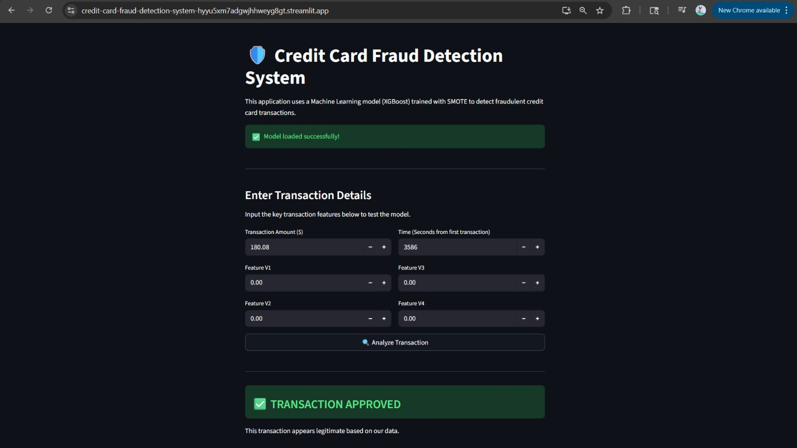
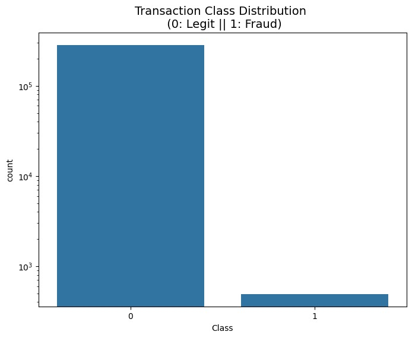
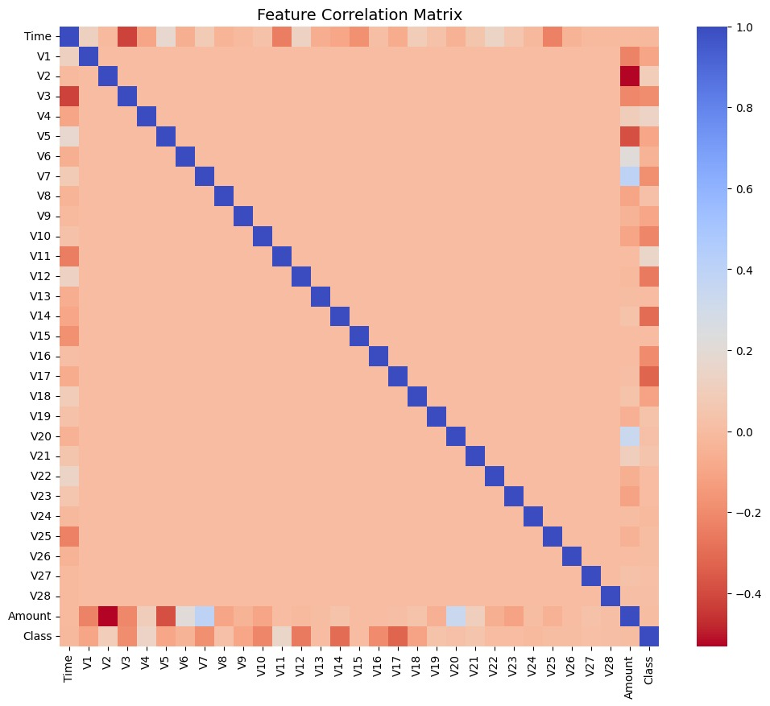
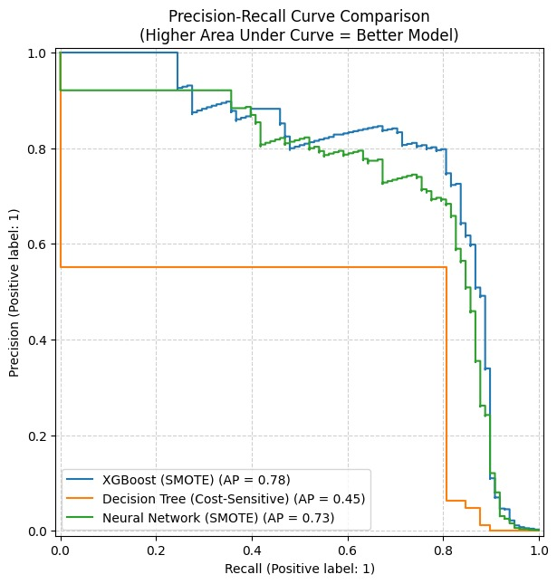
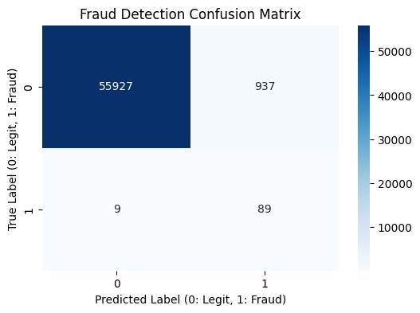
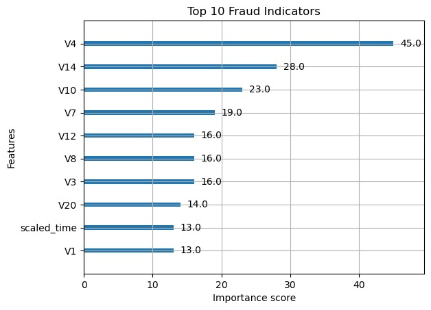

# 🛡️ Credit Card Fraud Detection System
**Predictive Analytics Course - Group Project**

[](https://credit-card-fraud-detection-system-hyyu5xm7adgwjhhweyg8gt.streamlit.app/)

### 👥 Team Members
* **Member 1:** Data Analyst (EDA, Preprocessing, Feature Engineering)
* **Member 2:** Lead Machine Learning Engineer (Model Building, SMOTE, Neural Networks)
* **Member 3:** DevOps & Interpretation (Streamlit Deployment, SHAP Analysis, Documentation)

---

## 🎯 Project Overview & Problem Statement
Financial fraud accounts for billions of dollars in losses annually. The primary challenge in fraud detection is **severe class imbalance**—legitimate transactions vastly outnumber fraudulent ones. 

This project aims to build a robust Binary Classification System to identify fraudulent transactions. Rather than chasing traditional "accuracy," our methodology focuses on **minimizing False Negatives** (missed fraud) through cost-sensitive learning and advanced over-sampling techniques (SMOTE), as the financial cost of missing a fraudulent transaction is exponentially higher than a False Positive.

---

## 🚀 Live Deployment
The final XGBoost model has been deployed as an interactive web application. 
**Access the live application here:** [Credit Card Fraud Detector App](https://credit-card-fraud-detection-system-hyyu5xm7adgwjhhweyg8gt.streamlit.app/)

 
*(Caption: Live prediction interface handling user input gracefully.)*

---

## 📊 Dataset Description
* **Source:** Kaggle Credit Card Fraud Dataset (`mlg-ulb/creditcardfraud`)
* **Size:** 284,807 transactions (0.17% fraudulent)
* **Features:** 28 PCA-transformed features (V1 - V28), `Time`, and `Amount`
* **Target:** `Class` (0 = Legitimate, 1 = Fraudulent)

---

## 🛠️ Data Science Life Cycle Methodology

We successfully implemented all 10 stages of the Data Science Project Life Cycle:

1. **Problem Definition:** Framed as a cost-sensitive binary classification problem.
2. **Data Collection:** Automated via `kagglehub` API for complete reproducibility.
3. **Data Preprocessing:** Addressed extreme outliers in financial data by applying `RobustScaler` to the `Time` and `Amount` features.
4. **Exploratory Data Analysis (EDA):** Visualized the 0.17% class imbalance using log-scale distributions and generated a correlation matrix to identify predictive signals.
5. **Feature Engineering:** Addressed the extreme class imbalance by applying **SMOTE** (Synthetic Minority Over-sampling Technique) strictly to the training set to prevent data leakage.
6. **Model Building:** Trained and compared three distinct architectures: Decision Trees, XGBoost, and Neural Networks.
7. **Model Evaluation:** Evaluated models using Precision-Recall curves (AUPRC) and Confusion Matrices instead of standard accuracy.
8. **Model Interpretation:** Extracted global feature importance to explain model decisions.
9. **Deployment:** Packaged the best-performing model (`fraud_model.pkl`) into a Streamlit web application.
10. **Documentation:** Maintained rigorous Git collaboration (Branching, PRs) and comprehensive Markdown documentation.

---

## 📈 Key Results & Visualizations

### 1. The Challenge: Extreme Class Imbalance
Initial exploration revealed a severe class imbalance. As shown in the logarithmic plot below, fraudulent transactions make up only **0.17%** of the dataset. This visual evidence confirmed that standard accuracy would be a misleading metric, making SMOTE and AUPRC evaluation strictly necessary.



### 2. Feature Correlation Matrix
The correlation matrix reveals how specific PCA features (V1 - V28) relate to the target class, guiding our feature selection process.



### 3. Model Performance (Precision-Recall)
Because of the imbalanced data, AUPRC (Area Under the Precision-Recall Curve) was our primary metric. **XGBoost (trained with SMOTE)** outperformed both Cost-Sensitive Decision Trees and Neural Networks, achieving an Average Precision (AP) of **0.78**.



### 4. Confusion Matrix (XGBoost)
The model successfully prioritized recall, catching the vast majority of fraud cases while keeping false positives manageable. 
* **True Negatives:** 55,927
* **True Positives:** 89 (Fraud Caught)
* **False Negatives:** Only 9 (Missed Fraud)



### 5. Model Interpretability (Top Fraud Indicators)
To ensure the model is not a "black box," we extracted the top 10 fraud indicators. Feature **V4** was identified as the most critical variable in determining fraudulent behavior, followed by V14 and V10.



---

## 💻 How to Run Locally

To reproduce this project on your local machine:

1. **Clone the repository:**
   ```bash
   git clone [https://github.com/lekshmipriya04/Credit-Card-Fraud-Detection-System.git](https://github.com/lekshmipriya04/Credit-Card-Fraud-Detection-System.git)
   cd Credit-Card-Fraud-Detection-System
